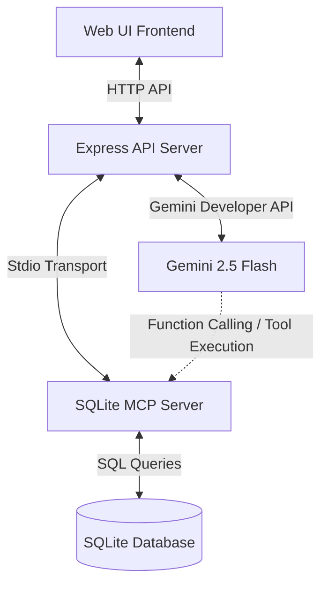

# GrindSpace Kaggle Capstone Project Writeup 🚀

This document serves as the technical writeup draft and architectural documentation for the **GrindSpace Focus Companion** submission for the **AI Agents: Intensive Vibe Coding Capstone Project**.

---

## 1. Executive Summary & Problem Statement

Modern productivity tools are often fragmented, require continuous cloud access, and lack the intelligence to act as true focus mentors. Furthermore, cloud-based productivity apps present significant data security and PII (Personally Identifiable Information) exposure risks for users tracking sensitive schedules.

### The Solution: GrindSpace
GrindSpace is an iOS-inspired, premium, offline-resilient focus companion. It combines local multi-client persistence, offline soundscapes using browser APIs, and secure, context-aware AI planning and coaching powered by Google's Gemini 2.5 Flash. 

To satisfy the rigorous hackathon submission criteria, we have integrated three major course concepts:
1. **Dedicated SQLite MCP (Model Context Protocol) Server:** Exposing local storage as standard tools.
2. **Collaborative Multi-Agent Architecture:** A Scheduler Agent and a Grind Coach Agent coordinating tool execution to curate plans and critiquing agendas.
3. **Local Security Guardrails:** Scrubbing sensitive data locally before cloud execution.

---

## 2. Technical Architecture & Agent Logic

GrindSpace uses a clean decoupled architecture consisting of a static web frontend, an Express API backend, and a dedicated SQLite MCP Server.



### Why Agents are the Right Solution
Traditional scheduling tools rely on rigid templates. By wrapping our application in an agentic framework:
* **The Scheduler Agent** dynamically reconciles messy, natural-language schedules, resolves overlap, and checks pending database tasks to insert them into the day.
* **The Grind Coach Agent** reads focus logs and task lists to offer personalized, adaptive motivation based on real user momentum.

---

## 3. Implementation Details: Satisfying Course Concepts

### Concept 1: Model Context Protocol (MCP) Server
We built a standards-compliant MCP Server ([mcp-server.js](file:///C:/Users/TONY/Downloads/GxK%20project/Capstone/mcp-server.js)) running on **stdio transport**. 
* The server registers the SQLite database endpoints as standard JSON-RPC tools (`get_tasks`, `add_task`, `update_task_status`, `get_focus_sessions`, `get_preferences`, `update_preference`).
* We implemented an MCP Client ([mcp-client.js](file:///C:/Users/TONY/Downloads/GxK%20project/Capstone/mcp-client.js)) inside the Express server that spawns the MCP process and calls tools dynamically.

### Concept 2: Collaborative Multi-Agent Flow
We upgraded the AI backend to a multi-agent system where agents share context and critique outputs:

1. **Daily Planner Endpoint (`/api/plan`):**
   * **Planner Agent** calls the `get_tasks` MCP tool to fetch all unfinished tasks.
   * It takes the user's raw schedule input and merges the pending database tasks into structured JSON blocks.
   * **Coach Agent** reviews the generated schedule and appends a direct, motivational critique (rendered in the UI).

2. **Grind Coach Endpoint (`/api/coach`):**
   * The **Coach Agent** has access to the MCP tool registrations (`mcpToolsToGeminiDeclarations`).
   * When asked conversational questions, Gemini executes a tool call to query tasks or focus session logs.
   * The backend executes the call via the MCP server and returns the output to Gemini to compile a customized response.

### Concept 3: Privacy & Security Guardrails
GrindSpace executes a PII Redaction Engine locally in [server.js](file:///C:/Users/TONY/Downloads/GxK%20project/Capstone/server.js#L17-L34) before sending user inputs to the cloud:
* **Emails:** Sanitized via standard email regex.
* **Phone Numbers:** Filtered for national and international formats.
* **Credentials/Secrets:** Detects password, token, and API key patterns to prevent key leakage.

---

## 4. Run & Verification Guide

### Setup & Run
1. Install dependencies:
   ```bash
   npm install
   ```
2. Configure `.env`:
   ```env
   PORT=3000
   GEMINI_API_KEY=your_gemini_key_here
   ```
3. Run the development server:
   ```bash
   npm run dev
   ```
4. Access the web dashboard at `http://localhost:3000`.

### Verifying MCP and Tool Executions
We have included automated verification test scripts in the codebase:
* **Test MCP Client/Server connection:** Runs stdio transport and reads DB preferences:
  ```bash
  node -e "require('./mcp-client').callMcpTool('get_preferences').then(console.log)"
  ```
